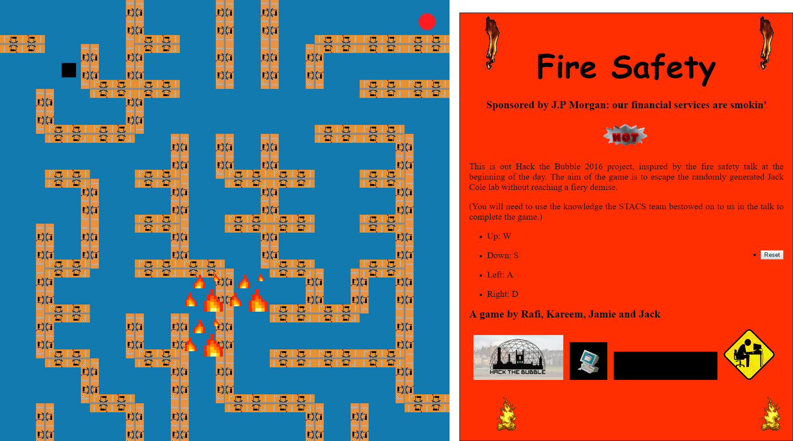

# HackTheBubble2016
The game I made (or mainly broke) with Jack, Jamie and Rafael

## Details
The game was written in pure JS (with no libraries being used). The game randomly generates levels (thanks to Rafael's algorithm) with
player having to escape the burning building (loosely based of the CS labs in St Andrews). The fire was implemented by Jack. Jamie implemented
the collision and movement systems. I implemented the graphics system. All the art in the game was drawn by Owen.

#Screenshot

